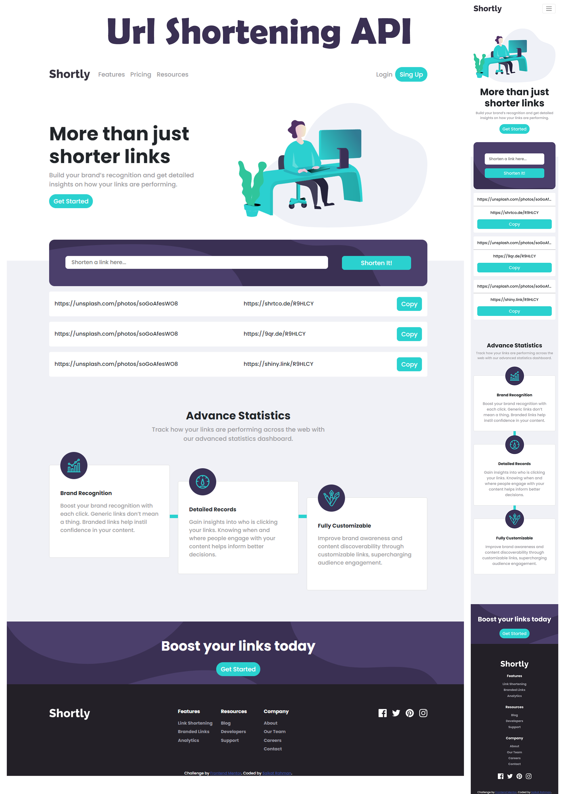

# Frontend Mentor - Shortly URL shortening API Challenge

Thanks for this front-end coding challenge. [Frontend Mentor](https://www.frontendmentor.io) challenges help me improve my coding skills by building realistic projects.

# Technology

For doing this challenge I use React and React Bootstrap.

# Live Site

You can see the live site [Url Shortening](https://link-shortening.netlify.app/)

# API Link

For completing this challenge I collect api from [shrtcode API](https://app.shrtco.de/)

# ScreenShot

